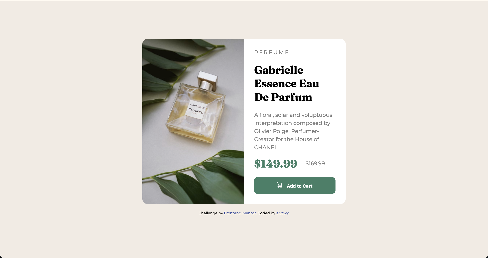

# Frontend Mentor - Product preview card component solution

This is a solution to the [Product preview card component challenge on Frontend Mentor](https://www.frontendmentor.io/challenges/product-preview-card-component-GO7UmttRfa). 

## Table of contents

- [Overview](#overview)
  - [The challenge](#the-challenge)
  - [Screenshot](#screenshot)
  - [Links](#links)
- [My process](#my-process)
  - [Built with](#built-with)
  - [What I learned](#what-i-learned)
  - [Continued development](#continued-development)

## Overview

### The challenge

Users should be able to:

- View the optimal layout depending on their device's screen size
- See hover and focus states for interactive elements

### Screenshot

### Links

- Live Site URL: [https://alvcwy.github.io/product-preview-card-component](https://alvcwy.github.io/product-preview-card-component)

## My process

### Built with

- HTML
- CSS
  - Flex display for aligning divs based on width of device
  - Responsive CSS for mobile/desktop resizing
- Javascript
  - Change image source based on width of device

### What I learned

This project gave me more practice on using Flexbox and resizing divs dynamically. 

I also tried using React at first, but React doesn't work well with displaying local images. I only had one component that I didn't really need to reuse (while React is good for making components once and using them multiple times), so I opted to use vanilla JS instead.

I think my strategy of setting border colors on divs, just so I can see how nested divs and images/text fit in them, was a good way to see if my code was working as intended.

### Continued development

Getting Flexbox set up took me a while (and a lot of experimenting). I would like more practice with Flexbox and possibly to build a solution using React. Another thing I could look into would be to optimize the display on tablets. The site works well on mobile/desktop but the div size might be too large on tablets.